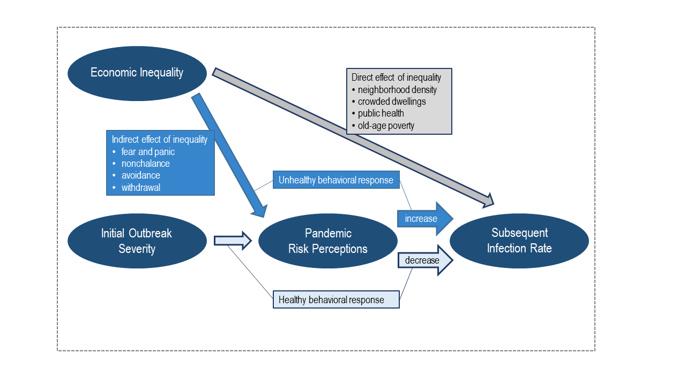
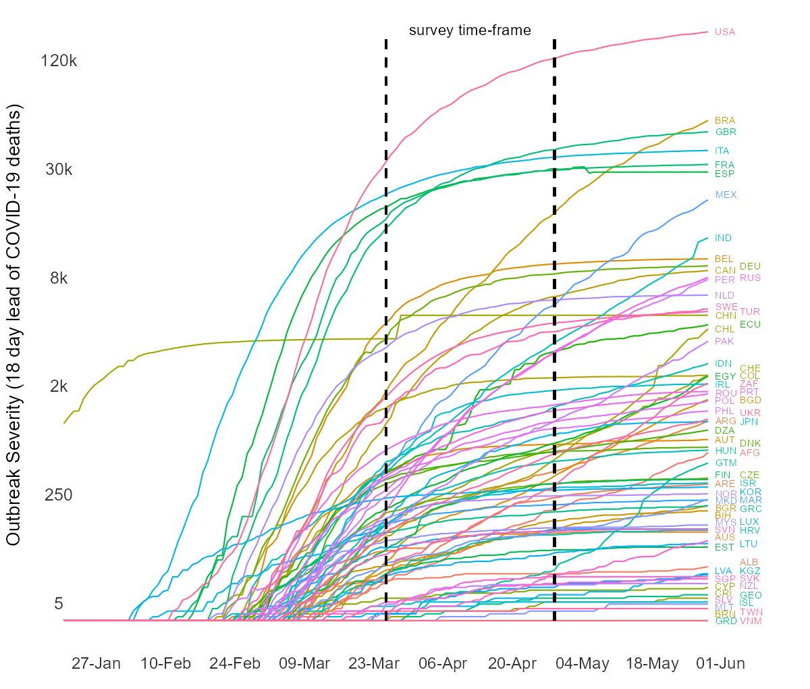

```{r setup, include=FALSE}
knitr::opts_chunk$set(echo = TRUE)

rm(list = ls(all = TRUE))

# this is a function to remove missing data
completeFun <- function(data, desiredCols) {
  completeVec <- complete.cases(data[, desiredCols])
  return(data[completeVec, ])
}

pacman::p_load("dplyr","countrycode","tidyverse","readstata13","countrycode","car","ggplot2","xlsx","tidyverse","stringi", "readxl","ragg")
```

```{r load}
load(file = "data/cis.Rdata")
```

## Figure 1. Theoretical Model

Created in PowerPoint, load here.

```{r fig1}

```


## Figure 2

As testing rates vary dramatically by country, we measure the number of deaths with an 18-day  lead as a better indicator of the severity of the outbreak by country. Those who died were inevitably sick or showing symptoms 18 days prior. 

```{r Fig1, warning=F, message=F, echo=T}

# this means the series ends at 06-01

deaths_long <- subset(deaths_long, date < as.Date("2020-06-02"))

# keep two extra days for plotting empty space

deaths_long$dead_lead <- ifelse(deaths_long$date > as.Date("2020-05-31"), NA, deaths_long$dead_lead)

# Using countries
deaths_longC <- subset(deaths_long, cow %in% use_countriesa)


# add Country name
deaths_longC$Country <- countrycode(deaths_longC$cow, "cown", "iso3c")
deaths_longC$Country <- ifelse(deaths_longC$cow ==  347, "KOS", deaths_longC$Country)


# log deaths
deaths_longC$dead_lead_log <- ifelse(deaths_longC$dead_lead > 3,log(deaths_longC$dead_lead),1)

# squared log deaths to accentuate differences
deaths_longC$dead_lead_log <- deaths_longC$dead_lead_log*deaths_longC$dead_lead_log

# create a label map so they do not overlap
deaths_longCL <- subset(deaths_longC, date == as.Date("2020-05-31"))
deaths_longCL <- deaths_longCL %>%
  mutate(date = ifelse(Country == "DEU" | Country == "RUS" | Country == "TUR" | Country == "ECU" | Country == "COL" | Country == "ZAF" | Country == "PRT" | Country == "BGD" | Country == "CHE" | Country == "UKR" | Country == "JPN" | Country == "DNK" | Country == "AFG" | Country == "CZE" | Country == "ISR" | Country == "KOR" | Country == "MAR" | Country == "GRC" | Country == "LUX" | Country == "HRV" | Country == "LTU" | Country == "ALB" | Country == "KGZ" | Country == "SVK" | Country == "NZL" | Country == "GEO" | Country == "ISL" | Country == "VNM" | Country == "TWN", "2020-06-06", "2020-06-01"),
         dead_lead_log = ifelse(Country == "CHE", 59.1, dead_lead_log),
         dead_lead_log = ifelse(Country == "DNK", 41.8, dead_lead_log),
         dead_lead_log = ifelse(Country == "UKR", 48.8, dead_lead_log),
         dead_lead_log = ifelse(Country == "CZE", 34.5, dead_lead_log),
         dead_lead_log = ifelse(Country == "KOR", 30.6, dead_lead_log),
         dead_lead_log = ifelse(Country == "MYS", 24.2, dead_lead_log),
         dead_lead_log = ifelse(Country == "AUS", 21.8, dead_lead_log),
         dead_lead_log = ifelse(Country == "LUX", 23.8, dead_lead_log),
         dead_lead_log = ifelse(Country == "FIN", 34.5, dead_lead_log),
         dead_lead_log = ifelse(Country == "KOS", 14, dead_lead_log),
         dead_lead_log = ifelse(Country == "ALB", 14.5, dead_lead_log),
         dead_lead_log = ifelse(Country == "LVA", 12.5, dead_lead_log),
         dead_lead_log = ifelse(Country == "GRC", 26.8, dead_lead_log),
         dead_lead_log = ifelse(Country == "KGZ", 12.5, dead_lead_log),
         dead_lead_log = ifelse(Country == "NZL", 9, dead_lead_log),
         dead_lead_log = ifelse(Country == "SVK", 10.5, dead_lead_log),
         dead_lead_log = ifelse(Country == "MEX", 99, dead_lead_log),
         dead_lead_log = ifelse(Country == "ESP", 103.8, dead_lead_log),
         dead_lead_log = ifelse(Country == "CRI", 7.35, dead_lead_log),
         dead_lead_log = ifelse(Country == "SLV", 5.78, dead_lead_log),
         dead_lead_log = ifelse(Country == "BRN", 2.6, dead_lead_log),
         dead_lead_log = ifelse(Country == "TWN", 3, dead_lead_log),
         dead_lead_log = ifelse(Country == "MLT", 4.16, dead_lead_log),
         dead_lead_log = ifelse(Country == "SWE", 73.2, dead_lead_log),
         dead_lead_log = ifelse(Country == "ZAF", 55.5, dead_lead_log),
          dead_lead_log = ifelse(Country == "ROU", 53.4, dead_lead_log),
         dead_lead_log = ifelse(Country == "ISL", 5.15, dead_lead_log),
         dead_lead_log = ifelse(Country == "CYP", 8.95, dead_lead_log),
         dead_lead_log = ifelse(Country == "SVK", 10.8, dead_lead_log))

# second go at labels
deaths_longCLa <- deaths_longCL


# labels need adjustment
deaths_longCLa <- deaths_longCLa %>%
  mutate(dead_lead_log = ifelse(Country == "AUS", 20.2, dead_lead_log),
         dead_lead_log = ifelse(Country == "BIH", 25.3, dead_lead_log),
         dead_lead_log = ifelse(Country == "BGR", 26.9, dead_lead_log),
         dead_lead_log = ifelse(Country == "MKD", 28.6, dead_lead_log),
         dead_lead_log = ifelse(Country == "MYS", 23.6, dead_lead_log))


fig2 <- ggplot(data=deaths_longC, aes(x=date , y=dead_lead_log, group=Country, color=Country)) +
    geom_line() +
  labs(x= "", y = "Outbreak Severity (18 day lead of COVID-19 deaths)") +
  geom_segment(aes(x = as.Date("2020-03-27"), y = 1, xend = as.Date("2020-03-27"), yend = 135), linetype = "dashed", color = "black", size = 0.8) +
  geom_segment(aes(x = as.Date("2020-04-30"), y = 1, xend = as.Date("2020-04-30"), yend = 135), linetype = "dashed", color = "black", size = 0.8) +
  annotate("text", x= as.Date("2020-01-21"), y= 5, 
           label="5", size=4.5, color = "gray20") +
  annotate("text", x= as.Date("2020-01-21"), y= 30, 
           label="250", size=4.5, color = "gray20") +
  annotate("text", x= as.Date("2020-01-21"), y= 55, 
           label="2k", size=4.5, color = "gray20") +
  annotate("text", x= as.Date("2020-01-21"), y= 80, 
           label="8k", size=4.5, color = "gray20") +
  annotate("text", x= as.Date("2020-01-21"), y= 105, 
           label="30k", size=4.5, color = "gray20") +
  annotate("text", x= as.Date("2020-01-21"), y= 130, 
           label="120k", size=4.5, color = "gray20") +
  annotate("text", x= as.Date("2020-04-13"), y=137, label="survey time-frame", size = 4, color="black") +
  scale_x_date(date_breaks = "2 weeks" , date_labels = "%d-%b") +
  geom_text(data = deaths_longCLa, aes(label = Country, colour = Country, x = as.Date(date), y = dead_lead_log, hjust = -.1), size = 2.62) +
  theme(legend.position = "none",
        panel.background = element_blank(),
        axis.text.y = element_blank(),
        axis.ticks = element_blank(),
        axis.title.y = element_text(size=14, vjust=-0.5),
        axis.text.x = element_text(vjust=1, hjust=0.35, color = "gray20", size = 12),
        plot.margin = margin(0, 1, 0, 0, "cm"))

# log conversion
# 30 = 250
# 55 = 2,000
# 80 = 8,000
# 105 = 28,000
# 130 = 120,000
agg_png(file = "results/Fig2.png", width = 1200, height = 1020,  res = 144)
print(fig2)
dev.off()


```
