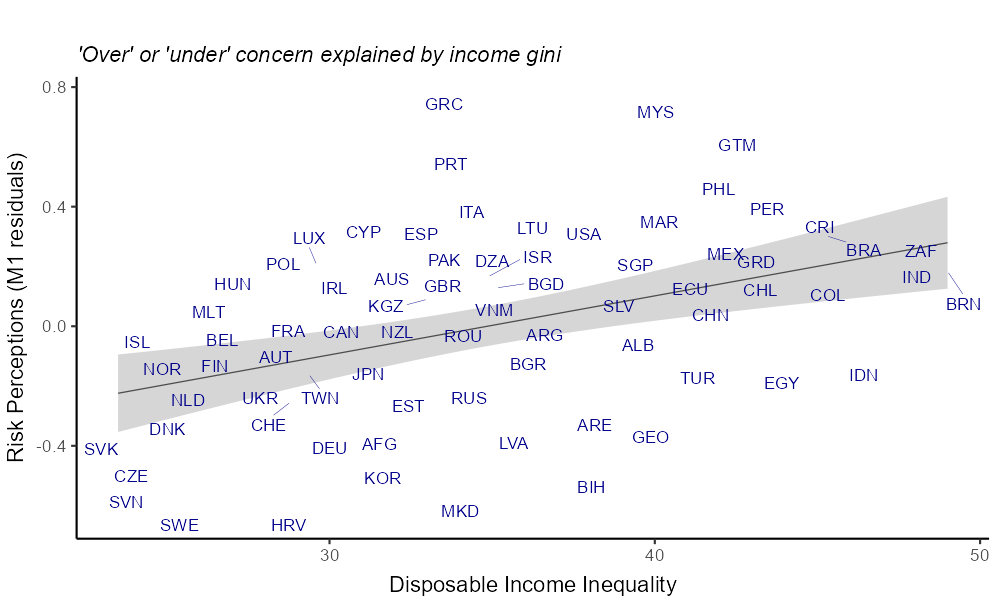

```{r setup, include=FALSE}
knitr::opts_chunk$set(echo = TRUE)

rm(list = ls(all = TRUE))

# this is a function to remove missing data
completeFun <- function(data, desiredCols) {
  completeVec <- complete.cases(data[, desiredCols])
  return(data[completeVec, ])
}

pacman::p_load("dplyr","countrycode", "tidyverse","readstata13","countrycode","car", "ggplot2","xlsx","tidyverse","stringi", "readxl","ragg","kableExtra", "ggrepel","sjPlot","lavaan","lm.beta", "semTable", "htmltools", "filesstrings")
```

```{r load}
load(file = "data/cis.Rdata")
```

## Figure 1. Theoretical Model

Created in PowerPoint, load here.

```{r fig1}
knitr::include_graphics("results/Fig1.png")
```


## Figure 2

As testing rates vary dramatically by country, we measure the number of deaths with an 18-day  lead as a better indicator of the severity of the outbreak by country. Those who died were inevitably sick or showing symptoms 18 days prior. 

```{r Fig1, warning=F, message=F, echo=T}

# this means the series ends at 06-01

deaths_long <- subset(deaths_long, date < as.Date("2020-06-02"))

# keep two extra days for plotting empty space

deaths_long$dead_lead <- ifelse(deaths_long$date > as.Date("2020-05-31"), NA, deaths_long$dead_lead)

# Using countries
deaths_longC <- subset(deaths_long, cow %in% use_countriesa)


# add Country name
deaths_longC$Country <- countrycode(deaths_longC$cow, "cown", "iso3c")
deaths_longC$Country <- ifelse(deaths_longC$cow ==  347, "KOS", deaths_longC$Country)


# log deaths
deaths_longC$dead_lead_log <- ifelse(deaths_longC$dead_lead > 3,log(deaths_longC$dead_lead),1)

# squared log deaths to accentuate differences
deaths_longC$dead_lead_log <- deaths_longC$dead_lead_log*deaths_longC$dead_lead_log

# create a label map so they do not overlap
deaths_longCL <- subset(deaths_longC, date == as.Date("2020-05-31"))
deaths_longCL <- deaths_longCL %>%
  mutate(date = ifelse(Country == "DEU" | Country == "RUS" | Country == "TUR" | Country == "ECU" | Country == "COL" | Country == "ZAF" | Country == "PRT" | Country == "BGD" | Country == "CHE" | Country == "UKR" | Country == "JPN" | Country == "DNK" | Country == "AFG" | Country == "CZE" | Country == "ISR" | Country == "KOR" | Country == "MAR" | Country == "GRC" | Country == "LUX" | Country == "HRV" | Country == "LTU" | Country == "ALB" | Country == "KGZ" | Country == "SVK" | Country == "NZL" | Country == "GEO" | Country == "ISL" | Country == "VNM" | Country == "TWN", "2020-06-06", "2020-06-01"),
         dead_lead_log = ifelse(Country == "CHE", 59.1, dead_lead_log),
         dead_lead_log = ifelse(Country == "DNK", 41.8, dead_lead_log),
         dead_lead_log = ifelse(Country == "UKR", 48.8, dead_lead_log),
         dead_lead_log = ifelse(Country == "CZE", 34.5, dead_lead_log),
         dead_lead_log = ifelse(Country == "KOR", 30.6, dead_lead_log),
         dead_lead_log = ifelse(Country == "MYS", 24.2, dead_lead_log),
         dead_lead_log = ifelse(Country == "AUS", 21.8, dead_lead_log),
         dead_lead_log = ifelse(Country == "LUX", 23.8, dead_lead_log),
         dead_lead_log = ifelse(Country == "FIN", 34.5, dead_lead_log),
         dead_lead_log = ifelse(Country == "KOS", 14, dead_lead_log),
         dead_lead_log = ifelse(Country == "ALB", 14.5, dead_lead_log),
         dead_lead_log = ifelse(Country == "LVA", 12.5, dead_lead_log),
         dead_lead_log = ifelse(Country == "GRC", 26.8, dead_lead_log),
         dead_lead_log = ifelse(Country == "KGZ", 12.5, dead_lead_log),
         dead_lead_log = ifelse(Country == "NZL", 9, dead_lead_log),
         dead_lead_log = ifelse(Country == "SVK", 10.5, dead_lead_log),
         dead_lead_log = ifelse(Country == "MEX", 99, dead_lead_log),
         dead_lead_log = ifelse(Country == "ESP", 103.8, dead_lead_log),
         dead_lead_log = ifelse(Country == "CRI", 7.35, dead_lead_log),
         dead_lead_log = ifelse(Country == "SLV", 5.78, dead_lead_log),
         dead_lead_log = ifelse(Country == "BRN", 2.6, dead_lead_log),
         dead_lead_log = ifelse(Country == "TWN", 3, dead_lead_log),
         dead_lead_log = ifelse(Country == "MLT", 4.16, dead_lead_log),
         dead_lead_log = ifelse(Country == "SWE", 73.2, dead_lead_log),
         dead_lead_log = ifelse(Country == "ZAF", 55.5, dead_lead_log),
          dead_lead_log = ifelse(Country == "ROU", 53.4, dead_lead_log),
         dead_lead_log = ifelse(Country == "ISL", 5.15, dead_lead_log),
         dead_lead_log = ifelse(Country == "CYP", 8.95, dead_lead_log),
         dead_lead_log = ifelse(Country == "SVK", 10.8, dead_lead_log))

# second go at labels
deaths_longCLa <- deaths_longCL


# labels need adjustment
deaths_longCLa <- deaths_longCLa %>%
  mutate(dead_lead_log = ifelse(Country == "AUS", 20.2, dead_lead_log),
         dead_lead_log = ifelse(Country == "BIH", 25.3, dead_lead_log),
         dead_lead_log = ifelse(Country == "BGR", 26.9, dead_lead_log),
         dead_lead_log = ifelse(Country == "MKD", 28.6, dead_lead_log),
         dead_lead_log = ifelse(Country == "MYS", 23.6, dead_lead_log))


fig2 <- ggplot(data=deaths_longC, aes(x=date , y=dead_lead_log, group=Country, color=Country)) +
    geom_line() +
  labs(x= "", y = "Outbreak Severity (18 day lead of COVID-19 deaths)") +
  geom_segment(aes(x = as.Date("2020-03-27"), y = 1, xend = as.Date("2020-03-27"), yend = 135), linetype = "dashed", color = "black", size = 0.8) +
  geom_segment(aes(x = as.Date("2020-04-30"), y = 1, xend = as.Date("2020-04-30"), yend = 135), linetype = "dashed", color = "black", size = 0.8) +
  annotate("text", x= as.Date("2020-01-21"), y= 5, 
           label="5", size=4.5, color = "gray20") +
  annotate("text", x= as.Date("2020-01-21"), y= 30, 
           label="250", size=4.5, color = "gray20") +
  annotate("text", x= as.Date("2020-01-21"), y= 55, 
           label="2k", size=4.5, color = "gray20") +
  annotate("text", x= as.Date("2020-01-21"), y= 80, 
           label="8k", size=4.5, color = "gray20") +
  annotate("text", x= as.Date("2020-01-21"), y= 105, 
           label="30k", size=4.5, color = "gray20") +
  annotate("text", x= as.Date("2020-01-21"), y= 130, 
           label="120k", size=4.5, color = "gray20") +
  annotate("text", x= as.Date("2020-04-13"), y=137, label="survey time-frame", size = 4, color="black") +
  scale_x_date(date_breaks = "2 weeks" , date_labels = "%d-%b") +
  geom_text(data = deaths_longCLa, aes(label = Country, colour = Country, x = as.Date(date), y = dead_lead_log, hjust = -.1), size = 2.62) +
  theme(legend.position = "none",
        panel.background = element_blank(),
        axis.text.y = element_blank(),
        axis.ticks = element_blank(),
        axis.title.y = element_text(size=14, vjust=-0.5),
        axis.text.x = element_text(vjust=1, hjust=0.35, color = "gray20", size = 12),
        plot.margin = margin(0, 1, 0, 0, "cm"))

# log conversion
# 30 = 250
# 55 = 2,000
# 80 = 8,000
# 105 = 28,000
# 130 = 120,000
agg_png(file = "results/Fig2.png", width = 1200, height = 1020,  res = 144)
print(fig2)
dev.off()
knitr::include_graphics("results/Fig2.png")

rm(deaths_longCL, deaths_longCLa)

```
## Final Data Adjustments

#### Set up 18-Day lead

```{r death outcomes}
infect_merge <- as.data.frame(matrix(nrow = 74, ncol = 1))
infect_merge[1:74,1] <- as.numeric(use_countriesa)
colnames(infect_merge) <- c("cow")

d1 <- subset(deaths_longC, date == "2020-05-01", select = c(cow, dead_lead))
d2 <- subset(deaths_longC, date == "2020-05-31", select = c(cow, dead_lead, dead_1st_date))

infect_merge <- left_join(infect_merge, d1, by = "cow")
infect_merge <- left_join(infect_merge, d2, by = "cow")

colnames(infect_merge) <- c("cow","dead_lead_may1","dead_lead_may31","dead_1st_date")

rm(d1,d2)

df <- left_join(finaldf_C, infect_merge, by = "cow")

# fix Argentina and Indonesia (last top1 observation was 2004)
df$top1 <- ifelse(df$cow == 160, .168, ifelse(df$cow == 850, .085, df$top1))

```


#### Infection Increase (Ratio May 1-31)

```{r rate_calc}

# There was a change in reporting in Spain and the deaths dropped suddenly on May 6th, adjust for this here. 

df$dead_lead_may1 <- ifelse(df$cow == 230, 27000, df$dead_lead_may1)
df <- df %>%
  mutate(rate_2 = ifelse(dead_lead_may31 == 0, 0, (dead_lead_may31 - dead_lead_may1) / (dead_lead_may1)),
         rate_2 = ifelse(rate_2 > 3, 3, rate_2) # trim outliers
  )

# deaths per capita May 1-31
df$newdthpc <- (df$dead_lead_may31 - df$dead_lead_may1)/df$pop
#make per 10,000 instead of per 1,000
df$newdthpc10 <- df$newdthpc*10
df$rate_3 <- df$newdthpc10
```

#### Squared Terms

```{r srts}
df <- df %>%
  mutate(gini_dispR = gini_disp/100, # make gini smaller to keep boundaries reasonable in SEM
         gini_disp2 = gini_dispR^2,
         concern_self2 = concern_self^2,
         gini_disp2C = gini_disp2 - mean(gini_disp2),
         concern_self2C = concern_self2 - mean(concern_self2))
```


## Main Models

### Statistics

#### Set up first models (baseline models)

M1 Timing + severity of outbreak should predict risk perceptions.
M22 Risk perceptions + risk perceptions-curve should predict deaths.

```{r m1_m21}
# adjust risk for severity of outbreak
m1 <- lm(concern_self ~ days_since_peak + conf_delta + gov_resp, data = df)

# predicted values
df$m1p <- predict.lm(m1, df)

# residuals
df$m1r <- df$concern_self - df$m1p 

m1a <- summary(m1)
m1a <- paste0("Adjusted r-square = ", round(m1a[["r.squared"]],3))

m23 <- lm(rate_2 ~ days_since_peak + conf_delta + gov_resp + concern_self + I(concern_self^2), data = df)


```

#### Descriptives

```{r descriptives}


cor <- select(df, concern_self, concern_self_se, days_since_peak, conf_delta, gov_resp, rate_2, rate_3, gini_disp, top1, socpolicy, gdp)

corm <- cor %>%
  mutate(concern_selfsd = sd(concern_self, na.rm = T),
         concern_self_sesd = sd(concern_self_se, na.rm = T),
         days_since_peaksd = sd(days_since_peak, na.rm = T),
         conf_deltasd = sd(conf_delta, na.rm = T),
         gov_respsd = sd(gov_resp, na.rm = T),
         rate_2sd = sd(rate_2, na.rm = T),
         rate_3sd = sd(rate_3, na.rm = T),
         gini_dispsd = sd(gini_disp, na.rm = T),
         top1sd = sd(top1, na.rm = T),
         socpolicysd = sd(socpolicy, na.rm = T),
         gdpsd = sd(gdp, na.rm = T),concern_self_min = min(concern_self, na.rm = T),
         concern_self_se_min = min(concern_self_se, na.rm = T),
         days_since_peak_min = min(days_since_peak, na.rm = T),
         conf_delta_min = min(conf_delta, na.rm = T),
         gov_resp_min = min(gov_resp, na.rm = T),
         rate_2min = min(rate_2, na.rm = T),
         rate_3min = min(rate_3, na.rm = T),
         gini_disp_min = min(gini_disp, na.rm = T),
         top1_min = min(top1, na.rm = T),
         socpolicy_min = min(socpolicy, na.rm = T),
         gdp_min = min(gdp, na.rm = T),
         concern_self_max = max(concern_self, na.rm = T),
         concern_self_se_max = max(concern_self_se, na.rm = T),
         days_since_peak_max = max(days_since_peak, na.rm = T),
         conf_delta_max = max(conf_delta, na.rm = T),
         gov_resp_max = max(gov_resp, na.rm = T),
         rate_2max = max(rate_2, na.rm = T),
         rate_3max = max(rate_3, na.rm = T),
         gini_disp_max = max(gini_disp, na.rm = T),
         top1_max = max(top1, na.rm = T),
         socpolicy_max = max(socpolicy, na.rm = T),
         gdp_max = max(gdp, na.rm = T),
         n = ifelse(!is.na(top1), 74, 57),
         concern_self = mean(concern_self, na.rm = T),
         concern_self_se = mean(concern_self_se, na.rm = T),
         days_since_peak = mean(days_since_peak, na.rm = T),
         conf_delta = mean(conf_delta, na.rm = T),
         gov_resp = mean(gov_resp, na.rm = T),
         rate_2 = mean(rate_2, na.rm = T),
         rate_3 = mean(rate_3, na.rm = T),
         gini_disp = mean(gini_disp, na.rm = T),
         top1 = mean(top1, na.rm = T),
         socpolicy = mean(socpolicy, na.rm = T),
         gdp = mean(gdp, na.rm = T))

cor2 <- round(corm[1,1:11], 2)
cor2[2,] <- round(corm[1,12:21], 2)
cor2[3,] <- round(corm[1,22:31], 2)
cor2[4,] <- round(corm[1,32:41], 2)
cor2[5,1:11] <- 74
cor2[5,9] <- 57


colnames(cor2) <- c("Risk Perception", "SE of Risk Perception by Country", "Days Since Curve Inflection", "New Cases Past Week","Strength of Gov Intervention", "Increase in Infection", "Increase in Infection per capita", "Disposable Income Gini", "Top 1% Income Concentration", "Welfare State", "GDP, per capita")

cor2 <- t(cor2)

colnames(cor2) <- c("Mean", "SD", "Min", "Max", "N")

kable_styling(kable(cor2, col.names = c("Mean", "SD", "Min", "Max", "N")))

tbl <- as.data.frame(c("3-item survey scale (COVIDiStress)", "Standard Error of individual level data","\"Outbreak Severity, actual\"; zero, or days since infection rate week-over-week started decreasing (Johns Hopkins, 18-day lead in COVID-19 deaths)", "\"Outbreak Severity, perceived\"; confirmned cases (Johns Hopkins)", "Severity of lockdown scale (Oxford/Blavatnik)","Ratio of infection, May 31st to 1","Same as above, divided by population","Average of all available data (Solt)","Top 1% share (WID)", "Labor Market Coverage (ILO) & Social Spending (OECD) averaged", "In thousands, (Maddison)"))

colnames(tbl) <- c("Measurement")
tbl1 <- cbind(tbl, cor2)

write.csv(tbl1, file = "results/Tbl1.csv")

```


#### Correlations

```{r corrs}

f1 <- cor(cor, use = "pairwise.complete.obs")


cor1 <- kable(f1, digits = 2, col.names = c("Risk Perception", "SE of Risk Perception by Country", "Days Since Curve Inflection", "New Cases Past Week","Strength of Gov Intervention", "Increase in Infection (ratio May 1-31)", "Increase in Infection (per capita May 1-31)", "Disposable Income Gini", "Top 1% Income Concentration", "Welfare State", "GDP, per capita (k)"))

kable_styling(cor1)
```
#### Additional Fig - CiS Cases per country

The COVIDiSTRESS (CiS) survey has a huge variance in cases per country

```{r plot_case_numbers, echo = T}

ggplot(df, aes(y = concern_self_se, x = cases)) +
  geom_point() +
  xlab("Cases Per Country") +
  ylab("Standard Error of the Mean") +
  theme_classic()

# ggplot(df, aes(x = reorder(iso, concern_self), y = concern_self)) + 
#  geom_bar(stat = "identity") +
#  geom_errorbar(aes(ymin = ymin, ymax = ymax))
```
#### Additional Figs - Residuals

This visualizes the relationship between observed and predicted values of risk perceptions and the regression results used for this prediction.

This introduces the difference between 'over' and 'under' concern with the Coronavirus on average in a population. 


```{r adjusted_risk, echo = T}


# plot fitted v observed
ggplot(df, aes(y=m1p, x=concern_self)) +
  geom_point() +
  geom_text_repel(aes(label=iso), vjust = 1.5) +
  geom_abline(slope=1) +

  xlab("Observed Risk Perceptions") +
  ylab("Predicted Risk Perceptions") +
  theme_classic()
```

#### Figure 3

```{r fig3, echo = T}


agg_png(file = "results/Fig3.png", width = 1000, height = 600, res = 144)
ggplot(df, aes(y=m1r, x=gini_disp)) +
  geom_smooth(method=lm, se=T, size = 0.3, color = "gray30") +
  geom_text_repel(aes(label=iso), size = 3, color = "blue4", segment.size = 0.1) +
  xlab("Disposable Income Inequality") +
  ylab("Risk Perceptions (M1 residuals)") +
  labs(title = "", subtitle = "\'Over\' or \'under\' concern explained by income gini") +
  theme_classic() + 
  theme(
  plot.title = element_text(),
  plot.subtitle = element_text(face = "italic"),
  plot.caption = element_text(size = 9, color = "grey30", vjust = -2.5),
  axis.title.x = element_text(vjust = -0.8),
  axis.title.y = element_text(vjust = 2),
  )
invisible(dev.off())

#    
```

#### Additional Fig - 3 Way Plot

```{r plot9, echo = T}
mid <- 34
# trim gini to get better color display
df$gini_color <- ifelse(df$gini_disp<45, df$gini_disp, 45)

ggplot(data=df, aes(x=conf_delta, y=concern_self, color = gini_color)) +
  geom_point() +
  geom_smooth(method=lm, se=FALSE, color = "gray50", linetype = "dashed") +
  geom_text_repel(aes(label = iso), size = 2.8) +
  scale_color_gradient2(midpoint=mid, low="blue", mid="gray55", high="red", space="Lab") +
  labs(x= "New Case Rate, past week", y = "Risk Perceptions", color = "Income Inequality\n(Gini, post\ntax & transfer)") +
      theme(panel.background = element_rect(fill = "white", colour = "grey50"),
        panel.grid.major = element_blank(),
        panel.grid.minor = element_blank(),
        legend.title = element_text(size = 10))
```

## Main Analyses

### Predicting Risk Perceptions

#### Table 1. M1 through M5

So far this works to convert html to png https://cloudconvert.com/html-to-png, but we should play around with htmltools package to automate this in the code

```{r reg_gini, echo = T}

#m1x <- lm(concern_self ~ days_since_peak + conf_delta + gov_resp*gov_resp_avg, data = df)

m2 <- lm(concern_self ~ days_since_peak + conf_delta + gov_resp + gini_disp, data = df)

# predicted values for sem
df$m2p <- predict.lm(m2, df)

# residuals
df$m2r <- df$concern_self - df$m2p 

m3 <- lm(concern_self ~ days_since_peak + conf_delta + gov_resp + socpolicy, data = df)

m4 <- lm(concern_self ~ days_since_peak + conf_delta + gov_resp + gdp, data = df)

m5 <- lm(concern_self ~ days_since_peak + conf_delta + gov_resp + gini_disp + socpolicy + gdp, data = df)


tab_model(m1, m2, m3, m4, m5, p.style = "stars", p.threshold = c(0.10, 0.05, 0.01), show.ci = F, rm.terms = c("(Intercept)"), show.loglik = T, show.aic = T, dv.labels = c("M1", "M2","M3", "M4","M5"), pred.labels = c("Days Since Curve Inflection", "New Case Rate", "Government Intervention", "Disposable Income Inequality", "Welfare State Strength", "GDP Per Capita"), file = "results/Tbl1.html")

```


#### Standardized Coefficients for Table 1

```{r std_reg}
tab_model(m1, m2, m3, m4, m5, p.style = "stars", p.threshold = c(0.10, 0.05, 0.01), show.ci = F, rm.terms = c("(Intercept)"), show.std = T, dv.labels = c("M1_Z", "M2_Z","M3_Z", "M4_Z","M5_Z"), pred.labels = c("Days Since Curve Inflection", "New Case Rate", "Government Intervention", "Disposable Income Inequality", "Welfare State Strength", "GDP Per Capita"))
```

#### Additional Table "M2_resid"- The Regression behind Fig 3

```{r resid_reg, echo = T}
m3r <- lm(m1r ~ days_since_peak + conf_delta + gov_resp + gini_disp, data = df)

tab_model(m3r, p.style = "stars", p.threshold = c(0.10, 0.05, 0.01), show.ci = F, rm.terms = c("(Intercept)"), show.std = T, dv.labels = c("M2_resid"), pred.labels = c("Days Since Curve Inflection", "New Case Rate", "Intervention Severity", "Disposable Income Inequality"))
```

#### Additional Table - Top 1% instead of Gini

```{r reg_top1, echo = T}
# create dataset with top1 data cases only

dft <- df[(!is.na(df$top1)),]

m1t <- lm(concern_self ~ days_since_peak + conf_delta + gov_resp, data = dft)

m2t <- lm(concern_self ~ days_since_peak + conf_delta + gov_resp + top1, data = dft)

m3t <- lm(concern_self ~ days_since_peak + conf_delta + gov_resp + socpolicy, data = dft)

m4t <- lm(concern_self ~ days_since_peak + conf_delta + gov_resp + gdp, data = dft)

m5t <- lm(concern_self ~ days_since_peak + conf_delta + gov_resp + top1 + socpolicy + gdp, data = dft)

tab_model(m1t, m2t, m3t, m4t, m5t, p.style = "stars", p.threshold = c(0.10, 0.05, 0.01), show.ci = F, rm.terms = c("(Intercept)"), show.loglik = T, show.aic = T, dv.labels = c("M11", "M12","M13", "M14","M15"), pred.labels = c("Days Since Curve Inflection", "New Case Rate", "Government Intervention", "Top 1% Income Concentration", "Welfare State Strength", "GDP Per Capita"))
```


#### Additional Table - Standardized Results for above

```{r std_reg_top1}
tab_model(m1t, m2t, m3t, m4t, m5t, p.style = "stars", p.threshold = c(0.10, 0.05, 0.01), show.ci = F, rm.terms = c("(Intercept)"), show.std = T, dv.labels = c("M11_Z", "M12_Z","M13_Z", "M14_Z","M15_Z"), pred.labels = c("Days Since Curve Inflection", "New Case Rate", "Intervention Severity", "Top 1% Income Concentration", "Welfare State Strength", "GDP Per Capita"))
```


### Predicting Infection Increase (ratio), May 1 - May 31

Conf_delta (new cases) measures a type of information the public and media consumes, it is actually a cause of a lower increase ratio of infection, probably because having awareness of a high infection increase leads to behavioral and policy changes. 


#### Additional Table. Infection Increase as DV

These are the OLS analyses that mirror those in Table 2, but without ML simultaneous estimation. Here OLS is our 'first run', but it is biased because it cannot estimate mediation effects and therefore M40-M43 (and M50-M53 with top 1%) are the preferred models due to maximum-likelihood estimation.

```{r reg2rate_3}
m21 <- lm(rate_2 ~ days_since_peak + conf_delta + gov_resp , data = df)

m22 <- lm(rate_2 ~ days_since_peak + conf_delta + gov_resp + concern_self, data = df)

m23 <- lm(rate_2 ~ days_since_peak + conf_delta + gov_resp + concern_self + I(concern_self^2), data = df)

m24 <- lm(rate_2 ~ days_since_peak + conf_delta + gov_resp +  gini_disp, data = df)

m25 <- lm(rate_2 ~ days_since_peak + conf_delta + gov_resp + concern_self + gini_disp, data = df)

m26 <- lm(rate_2 ~ days_since_peak + conf_delta + gov_resp + gini_disp + I(gini_disp^2), data = df)

m27 <- lm(rate_2 ~ days_since_peak + conf_delta + gov_resp +  concern_self + I(concern_self^2) + gini_disp + I(gini_disp^2), data = df)


tab_model(m21, m22, m23, m24, m25, m26, m27, p.style = "stars", p.threshold = c(0.10, 0.05, 0.01), show.ci = F, rm.terms = c("(Intercept)"), show.loglik = T, show.aic = T, dv.labels = c("M21", "M22","M23", "M24","M25","M26","M27"), pred.labels = c("Days Since Curve Inflection", "New Case Rate", "Government Intervention", "Risk Perceptions", "Risk Perceptions^2", "Disposable Income Inequality", "Disposable Income Inequality^2"))


```

```{r stdz_m27}
m27_beta <- lm.beta(m27)
m27_beta_concern <- m27_beta[["standardized.coefficients"]][["concern_self"]] + m27_beta[["standardized.coefficients"]][["I(concern_self^2)"]]

m27_beta_gini <- m27_beta[["standardized.coefficients"]][["gini_disp"]] + m27_beta[["standardized.coefficients"]][["I(gini_disp^2)"]]
```

#### Standardized Coefficients M27

Standardized combined effect of term + term^2

Risk Perceptions = `r print(m27_beta_concern)`
Disposable Income Inequality = `r print(m27_beta_gini)`


#### Additional Table. Infection Increase as DV Using Top 1% instead. 

```{r reg2rate_2}
m31 <- lm(rate_2 ~ days_since_peak + conf_delta + gov_resp , data = dft)

m32 <- lm(rate_2 ~ days_since_peak + conf_delta + gov_resp + concern_self, data = dft)

m33 <- lm(rate_2 ~ days_since_peak + conf_delta + gov_resp + concern_self + I(concern_self^2), data = dft)

m34 <- lm(rate_2 ~ days_since_peak + conf_delta + gov_resp +  top1, data = dft)

m35 <- lm(rate_2 ~ days_since_peak + conf_delta + gov_resp + concern_self + top1, data = df)

m36 <- lm(rate_2 ~ days_since_peak + conf_delta + gov_resp + top1 + I(top1^2), data = dft)

m37 <- lm(rate_2 ~ days_since_peak + conf_delta + gov_resp +  concern_self + I(concern_self^2) + top1 + I(top1^2), data = dft)

tab_model(m31, m32, m33, m34, m35, m36, m37, p.style = "stars", p.threshold = c(0.10, 0.05, 0.01), show.ci = F, rm.terms = c("(Intercept)"), show.loglik = T, show.aic = T, dv.labels = c("M31", "M32","M33", "M34","M35","M36", "M37"), pred.labels = c("Days Since Curve Inflection", "New Case Rate", "Government Intervention", "Risk Perceptions", "Risk Perceptions^2", "Disposable Income Inequality", "Disposable Income Inequality^2"))


```

#### Standardized Coefficients M37

```{r stdz_m37}
m37_beta <- lm.beta(m37)
m37_beta_concern <- m37_beta[["standardized.coefficients"]][["concern_self"]] + m37_beta[["standardized.coefficients"]][["I(concern_self^2)"]]

m37_beta_gini <- m37_beta[["standardized.coefficients"]][["top1"]] + m37_beta[["standardized.coefficients"]][["I(top1^2)"]]
```

Standardized combined effect of term + term^2

Risk Perceptions = `r print(m37_beta_concern)`
Disposable Income Inequality = `r print(m37_beta_gini)`


### Mediation Analysis

SEM squared variables must be constructed by hand. To keep estimates 'under control', it is useful to center the variables.

#### M40 Baseline Model

This is a maximum-likelihood estimated combination of M1 and M23, i.e., a structural equation model.


```{r sem_baseline}
m40 <- '     rate_2 ~ days_since_peak + conf_delta + gov_resp + concern_self + b2*concern_self2  + c1*gini_dispR + c2*gini_disp2
             concern_self ~ days_since_peak + conf_delta + gov_resp + a1*gini_dispR + a2*gini_disp2
           # this is critical because we constructed one out of the other   
             concern_self2 ~ concern_self
           # covariances

           # intercepts
             rate_2 ~ 1
             concern_self ~ 1
           # constraints
             c1 == 0
             c2 == 0
             b2 == 0
             a1 == 0
             a2 == 0
         '
m40fit <- sem(m40, data = df)
summary(m40fit, fit.measures = T)


```

```{r semstdz41, echo = T}
standardizedsolution(m40fit)
```
#### M41

This is a model that is M40 plus linear mediation of inequality by risk perceptions

```{r sem1}
m41 <- '   # direct effect
             rate_2 ~ c1*gini_dispR + c2*gini_disp2 + days_since_peak + conf_delta + gov_resp 
           # mediator
             concern_self ~ a1*gini_dispR + a2*gini_disp2 + days_since_peak + conf_delta + gov_resp 
             rate_2 ~ b1*concern_self + b2*concern_self2
           # this is critical because we constructed one out of the other   
             concern_self2 ~ concern_self
           # covariances

           # intercepts
             rate_2 ~ 1
             concern_self ~ 1
           # constraints
             c2 == 0
             a2 == 0
             b2 == 0
           # indirect effect 
             ab := a1*b1
           # total effect
             total := c1 + a1*b1
         '
m41fit <- sem(m41, data = df)

Tbl4 <- semTable(m41fit, type = "html", print.results = F)
semTable(m41fit, type = "html", print.results = F)
save_html(Tbl4, "Tbl4.html", background = "white", libdir = "results/")
 
file.move("Tbl4.html", "results/Tbl4.html")

knit_print.html(Tbl4)

```

```{r semstdz, echo = T}
standardizedsolution(m41fit)
```

```{r fig4_mediation, echo = T}

```

#### M42 

This adds the squared term for risk perceptions.


```{r sem42, echo = T}
m42 <- '   # direct effect
             rate_2 ~ c1*gini_dispR + c2*gini_disp2 + days_since_peak + conf_delta + gov_resp 
           # mediator
             concern_self ~ a1*gini_dispR + a2*gini_disp2 + days_since_peak + conf_delta + gov_resp 
             rate_2 ~ b1*concern_self + b2*concern_self2
           # this is critical because we constructed one out of the other   
             concern_self2 ~ concern_self
           # covariances

           # intercepts
             rate_2 ~ 1
             concern_self ~ 1
           # constraints
             c2 == 0
             a2 == 0

         '
m42fit <- sem(m42, data = df, meanstructure = T)
summary(m42fit, fit.measures = T)
standardizedsolution(m42fit)
```


#### M43


##### M43 raw estimates

```{r sem43}
m43 <- '   # direct effect
             rate_2 ~ c1*gini_dispR + c2*gini_disp2 + w11*days_since_peak + w12*conf_delta + w13*gov_resp 
           # mediator
             concern_self ~ a1*gini_dispR + a2*gini_disp2 + w1*days_since_peak + w2*conf_delta + w3*gov_resp 
             rate_2 ~ b1*concern_self + b2*concern_self2 
           # this is critical because we constructed one out of the other   
             concern_self2 ~ concern_self
           # intercept naming
             concern_self ~ i1*1
             rate_2 ~ i2*1
           # constraint
             a2 == 0

         '
m43fit <- sem(m43, data = df, meanstructure = T)

summary(m43fit, fit.measures = T)
```


```{r sem43stdz}
standardizedsolution(m43fit)
```


#### M43 for prediction/calculation

This strategy follows Hayes and Preacher (2010). The effect is non-linear meaning that it is heterogeneous. There is no single value of the income inequality effect. Hayes and Preacher (2010) suggest estimating an **instantaneous indirect effect** which is actually based on derivatives and then can be plotted as different effects at different levels.

Table 1 in Hayes and Preacher (2010) offers the derivation of the formulas:

Mediation Formulas

$\hat{Y} = i_{2} + c'_{1}X + c'_{2}X^{2} + b_{1}M + b_{2}M^{2}$

$\hat{M} = i_{1} + aX$

Instantaneous Indirect Effects of $X$ on $Y$ through $M$ are derived as (Table 1):

$a(b_{1} + 2b_{2}\hat{M})$)

The only problem is that the effect of X includes a squared term, this squared term must be treated as a covariate (like $W$ in their paper) and then the model should work, changing the squared term's fixed value for each.

Also, to get predicted instantaneous indirect effect we need to remove the covariance of concern_self and gini_disp2 from contaminating the estimates. We fixed gini_disp2 to zero in the equation for concern_self, thus the algorithm find every other possible way to explain this residual correlation before letting it fall into the residual. This likely skews the results, therefore, for prediction purposes we allow all of this correlation to simply fall into the residual thus alighing the instantaneous indirect effect with the predicted values of rate_2

```{r sem43_pred, warning = F, message = F}
m43p <- '   # direct effect
             rate_2 ~ c1*gini_dispR + c2*gini_disp2 + w11*days_since_peak + w12*conf_delta + w13*gov_resp 
           # mediator
             concern_self ~ a1*gini_dispR + a2*gini_disp2 + w1*days_since_peak + w2*conf_delta + w3*gov_resp 
             rate_2 ~ b1*concern_self + b2*concern_self2 
           # this is critical because we constructed one out of the other   
             concern_self2 ~ concern_self
           # to fix the residual variance out of the predictions of the model this is necessary
             concern_self ~~ gini_disp2
           # intercept naming
             concern_self ~ i1*1
             rate_2 ~ i2*1
           # constraint
             a2 == 0
           # instantaneous indir effect calc at values
             x1 := .225
             x2 := .25
             x3 := .275
             x4 := .30
             x5 := .325
             x6 := .35
             x7 := .375
             x8 := .40
             x9 := .425
             x10 := .45
             x11 := .475
             x12 := .50
           # requires fixing covariates and gini_disp2 = 0 
             predm1 := i1+(a1*x1)+w1*.30+w2*0.37+0*w3
             predm2 := i1+(a1*x2)+w1*.30+w2*0.37+0*w3
             predm3 := i1+(a1*x3)+w1*.30+w2*0.37+0*w3
             predm4 := i1+(a1*x4)+w1*.30+w2*0.37+0*w3
             predm5 := i1+(a1*x5)+w1*.30+w2*0.37+0*w3
             predm6 := i1+(a1*x6)+w1*.30+w2*0.37+0*w3
             predm7 := i1+(a1*x7)+w1*.30+w2*0.37+0*w3
             predm8 := i1+(a1*x8)+w1*.30+w2*0.37+0*w3
             predm9 := i1+(a1*x9)+w1*.30+w2*0.37+0*w3
             predm10 := i1+(a1*x10)+w1*.30+w2*0.37+0*w3
             predm11 := i1+(a1*x11)+w1*.30+w2*0.37+0*w3
             predm12 := i1+(a1*x12)+w1*.30+w2*0.37+0*w3
           # instantaneous indirect effects (gini_disp2 must be held constant here)
             theta1 := (b1+2*b2*predm1)*a1
             theta2 := (b1+2*b2*predm2)*a1
             theta3 := (b1+2*b2*predm3)*a1
             theta4 := (b1+2*b2*predm4)*a1
             theta5 := (b1+2*b2*predm5)*a1
             theta6 := (b1+2*b2*predm6)*a1
             theta7 := (b1+2*b2*predm7)*a1
             theta8 := (b1+2*b2*predm8)*a1
             theta9 := (b1+2*b2*predm9)*a1
             theta10 := (b1+2*b2*predm10)*a1
             theta11 := (b1+2*b2*predm11)*a1
             theta12 := (b1+2*b2*predm12)*a1
           # pred values
             predy1 := i2 + c1*x1 + c2*x1*x1 + b1*predm1 + b2*predm1*predm1 + w11*.30+w12*0.37+0*w13
             predy2 := i2 + c1*x2 + c2*x2*x2 + b1*predm2 + b2*predm2*predm2 + w11*.30+w12*0.37+0*w13
             predy3 := i2 + c1*x3 + c2*x3*x3 + b1*predm3 + b2*predm3*predm3 + w11*.30+w12*0.37+0*w13
             predy4 := i2 + c1*x4 + c2*x4*x4 + b1*predm4 + b2*predm4*predm4 + w11*.30+w12*0.37+0*w13
             predy5 := i2 + c1*x5 + c2*x5*x5 + b1*predm5 + b2*predm5*predm5 + w11*.30+w12*0.37+0*w13
             predy6 := i2 + c1*x6 + c2*x6*x6 + b1*predm6 + b2*predm6*predm6 + w11*.30+w12*0.37+0*w13
             predy7 := i2 + c1*x7 + c2*x7*x7 + b1*predm7 + b2*predm7*predm7 + w11*.30+w12*0.37+0*w13
             predy8 := i2 + c1*x8 + c2*x8*x8 + b1*predm8 + b2*predm8*predm8 + w11*.30+w12*0.37+0*w13
             predy9 := i2 + c1*x9 + c2*x9*x9 + b1*predm9 + b2*predm9*predm9 + w11*.30+w12*0.37+0*w13
             predy10 := i2 + c1*x10 + c2*x10*x10 + b1*predm10 + b2*predm10*predm10 + w11*.30+w12*0.37+0*w13
             predy11 := i2 + c1*x11 + c2*x11*x11 + b1*predm11 + b2*predm11*predm11 + w11*.30+w12*0.37+0*w13
             predy12 := i2 + c1*x12 + c2*x12*x12 + b1*predm12 + b2*predm12*predm12 + w11*.30+w12*0.37+0*w13

         '
m43pfit <- sem(m43p, data = df, meanstructure = T)


```

#### Table 2. Main Models

We used an html template from tab_model command and hand edited the values to produce a table that was visually identical to Table 1. Automation would be ideal here, but we double checked the scores.

```{r tab_sem, results = 'hide'}
# set up frames

m40tab <- matrix(summary(m40fit, fit.measures = T))
m40fits <- as.data.frame(m40tab[[1]])
m40parm <- as.data.frame(m40tab[[2]])
m40parm <- select(m40parm, -c(label, exo))
m41tab <- matrix(summary(m41fit, fit.measures = T))
m41fits <- as.data.frame(m41tab[[1]])
m41parm <- as.data.frame(m41tab[[2]])
m41parm <- select(m41parm, -c(label, exo))
m42tab <- matrix(summary(m42fit, fit.measures = T))
m42fits <- as.data.frame(m42tab[[1]])
m42parm <- as.data.frame(m42tab[[2]])
m42parm <- select(m42parm, -c(label,exo))
m43tab <- matrix(summary(m43fit, fit.measures = T))
m43fits <- as.data.frame(m43tab[[1]])
m43parm <- as.data.frame(m43tab[[2]])
m43parm <- select(m43parm, -c(label, exo))

# combine and name which results go with which models

semtab <- rbind(m40parm,m41parm,m42parm,m43parm)
semtab_labels <- as.data.frame(matrix(nrow = length(semtab[,1]), ncol = 1))
semtab_labels$V1 <- as.list(unlist(strsplit(paste(paste(replicate(length(m40parm[,1]), "m40"), collapse = ","), paste(replicate(length(m41parm[,1]), "m41"), collapse = ","), paste(replicate(length(m42parm[,1]), "m42"), collapse = ","), paste(replicate(length(m43parm[,1]), "m43"), collapse = ","), sep = ","), ",")))

semtab <- cbind(semtab_labels, semtab)
semtab <- semtab %>%
  mutate(est = round(est,3),
         se = round(se,3),
         pvalue = round(pvalue,3),
         stars = ifelse(pvalue>0.1,"", ifelse(pvalue>0.05,"*", ifelse(pvalue>0.01,"**","***"))),
         est = ifelse(rhs == "gini_dispR" | rhs == "gini_disp2", est/100, est),
         se = ifelse(rhs == "gini_dispR" | rhs == "gini_disp2", se/100, se)
  )

semtab <- subset(semtab, op == "~" & lhs!= "concern_self2")


semfits <- round(cbind(m40fits,m41fits,m42fits,m43fits),3)
colnames(semfits) <- c("m40","m41","m42","m43")

# get r-squared
m40r2 <- round(as.data.frame(inspect(m40fit,'r2')),3)
m41r2 <- round(as.data.frame(inspect(m41fit,'r2')),3)
m42r2 <- round(as.data.frame(inspect(m42fit,'r2')),3)
m43r2 <- round(as.data.frame(inspect(m43fit,'r2')),3)

semr2s <- cbind(m40r2,m41r2,m42r2,m43r2)
semr2s <- semr2s[1:2,]
colnames(semr2s) <- c("m40","m41","m42","m43")

semfits <- rbind(semfits,semr2s)

semfits <- semfits[c("rate_2", "concern_self", "aic", "bic", "logl"),]

rm(m40tab, m40fits, m40parm, m41tab, m41fits, m41parm, m42tab, m42fits, m42parm, m43tab, m43fits, m43parm, m40r2,m41r2,m42r2,m43r2, semr2s, semtab_labels)

kable(semtab)
kable(semfits)

```

To create a table identical to the tab_model table we adjust the html code by hand, but hopefully we can automate this in the future.

```{r table2}

```


#### Figure 5

```{r plotting_data, results = 'hide'}
m43mat <- summary(m43pfit)
m43mat <- as.data.frame(m43mat[["PE"]])
a43 <- m43mat[38:49,]
a43 <- select(a43, rhs)
a43$rhs <- as.numeric(a43$rhs)
colnames(a43) <- c("X_gini")
b43 <- m43mat[50:61,]
b43 <- select(b43, label, est)
colnames(b43) <- c("moderator","pred_M")
c43 <- m43mat[62:73,]
c43 <- select(c43, est, se, z, pvalue)
colnames(c43) <- c("inst_indr_effect","iie_se","iie_z","iie_p")
d43 <- m43mat[74:85,]
d43 <- select(d43, est, se, z, pvalue)
colnames(d43) <- c("pred_Y","Y_se","Y_z","Y_p")

m43mat <- cbind(a43,b43,c43,d43)

# Now transform so that all values are relative to an 'average', axis cross

# 1 - rescale Gini back into its 100-point original scale
m43mat <- m43mat %>%
  mutate(X_gini = round(X_gini*100,1),
         pred_MC = pred_M - mean(pred_M),
         iie_orig = inst_indr_effect/100,
         iie_origC = iie_orig - mean(iie_orig),
         pred_YavgC = 0.33820*pred_Y, # make avg-Y_hat mean = avg-Y mean
         ymin = pred_YavgC - 1.96*Y_se*0.33820,
         ymax = pred_YavgC + 1.96*Y_se*0.33820)# add 95% confidence intervals)


rm(a43,b43,c43,d43)


  
```

```{r plots}
agg_png(file = "results/Fig5.png", width = 800, height = 600, res = 144)
ggplot(data = m43mat, aes(x = X_gini)) +
  geom_abline(intercept = 0, slope = 0, size = 0.25, color = "grey2") +
  geom_ribbon(aes(ymin=ymin,ymax=ymax), fill = "grey70") +
  geom_line(aes(y = pred_YavgC, color = "a"), size = 1) +
  geom_line(aes(y = pred_MC, color = "b"), size = 1) +
  geom_line(aes(y = iie_orig, color = "c"), size = 1) +
  geom_vline(xintercept = 31, linetype = 5, color = "darkgoldenrod4") +
  annotate(geom="label", x=26, y=1.7, label="Increasing inequality =\nLESS infections",
              color="darkgoldenrod4", size = 2.5) +
  annotate(geom="label", x=36, y=1.7, label="Increasing inequality =\nMORE infections",
              color="darkgoldenrod4", size = 2.5) +
  geom_segment(aes(x = 30.5, y = 1.7, xend = 29.5, yend = 1.7),
                  arrow = arrow(length = unit(0.2, "cm"), type = "closed"), colour = "darkgoldenrod4") +
  geom_segment(aes(x = 31.5, y = 1.7, xend = 32.5, yend = 1.7),
                  arrow = arrow(length = unit(0.2, "cm"), type = "closed"), colour = "darkgoldenrod4") +
  scale_color_manual(name = "", labels = c("a" = "Infection Increase (Y)\nMay 1st to May 31st\nratio, predicted", "c" = "Instantaneous\nIndirect Effect\n(rate of change)" , "b" = "Risk Perceptions (M)\nApril, 2020\npredicted, centered"), values = c("a" = "red", "b" = "blue", "c" = "darkgoldenrod4")) +
  scale_x_continuous(breaks = c(25,30,35,40,45,50), expand = c(0,0)) +
  scale_y_continuous(breaks = c(-1,-0.5,0,0.5,1,1.5,2), limits = c(-1,2), expand = c(0,0)) +
  labs(x = "Disposable Income Inequality (X), gini",y = "Estimate") +
  theme(panel.background = element_blank(),
        panel.grid = element_blank(),
        axis.line = element_line(),
        legend.position = "bottom",
        legend.background = element_rect(fill = "#BFD5E3"),
        legend.key = element_rect(fill = "#BFD5E3"),
        plot.margin=unit(c(1,1,0.1,0.3),"cm"))
dev.off()


```


We know that there is a risk of random sampling variation causing disturbance to the results. Therefore we again simulate the variability in the mean risk perceptions by country. 

Get rid of earlier sampling robustness exercise and just do it here for both.

#### Robustness of Mediation Effect to Sampling. Simulating Plausible Alternative Values for Country-Means

The confidence interval of our regression estimates is based on a sampling distribution across countries, but we have a potentially large source of uncertainty within countries due to the use of an online survey and some very small samples. The online survey problem cannot be solved directly through bootstrapping, but we can asses the robustness of our estimates using the within-country uncertainty. 

We 'bootstrap' the estimates by generating random data that follow a normal distribution for each country based on the standard error. Then we run the analysis on each dataset to generate a confidence interval for our estimates that incorporates the within-country standard error of the mean.

```{r robust_sim, message = F, warning = F, include = F}
# The standard error takes into account the sample size, so now we create a simulation standard deviation based on the standard error leading to variation in means across 1000 simulations and a normal distribution.


sim_df <- as.data.frame(matrix(nrow = 1000, ncol = 74))
set.seed(91825)
colnames(sim_df) <- c("sim_2", "sim_20",  "sim_55",  "sim_70",  "sim_90",  "sim_92",  "sim_94", "sim_100", "sim_130", "sim_135", "sim_140", "sim_155", "sim_160", "sim_200", "sim_205", "sim_210", "sim_211", "sim_212", "sim_220", "sim_225", "sim_230", "sim_235", "sim_255", "sim_290", "sim_305", "sim_310", "sim_316", "sim_317", "sim_325", "sim_338", "sim_339", "sim_343", "sim_344", "sim_346", "sim_349", "sim_350", "sim_352", "sim_355", "sim_360", "sim_365", "sim_366", "sim_367", "sim_368", "sim_369", "sim_372", "sim_375", "sim_380", "sim_385", "sim_390", "sim_395", "sim_560", "sim_600", "sim_615", "sim_640", "sim_651", "sim_666", "sim_696", "sim_700", "sim_703", "sim_710", "sim_713", "sim_732", "sim_740", "sim_750", "sim_770", "sim_771", "sim_816", "sim_820", "sim_830", "sim_835", "sim_840", "sim_850", "sim_900", "sim_920")

for (c in use_countriesa){
  sim_df[paste0("sim_", c)] <- rnorm(1000, mean = finaldf_C[finaldf_C$cow == c, "concern_self"], sd = finaldf_C[finaldf_C$cow == c, "concern_self_se"])
}

sim_df_wide <- as.data.frame(t(sim_df))

sim_df_wide$cow <- df$cow

finaldf_Ca_sim <- left_join(df, sim_df_wide, by = "cow")


```


```{r robust_sim2, message = F, warning = F, include = F}
# Now repeat with a different seed


sim_dfa <- as.data.frame(matrix(nrow = 1000, ncol = 74))
set.seed(66666)
colnames(sim_dfa) <- c("sima_2", "sima_20",  "sima_55",  "sima_70",  "sima_90",  "sima_92",  "sima_94", "sima_100", "sima_130", "sima_135", "sima_140", "sima_155", "sima_160", "sima_200", "sima_205", "sima_210", "sima_211", "sima_212", "sima_220", "sima_225", "sima_230", "sima_235", "sima_255", "sima_290", "sima_305", "sima_310", "sima_316", "sima_317", "sima_325", "sima_338", "sima_339", "sima_343", "sima_344", "sima_346", "sima_349", "sima_350", "sima_352", "sima_355", "sima_360", "sima_365", "sima_366", "sima_367", "sima_368", "sima_369", "sima_372", "sima_375", "sima_380", "sima_385", "sima_390", "sima_395", "sima_560", "sima_600", "sima_615", "sima_640", "sima_651", "sima_666", "sima_696", "sima_700", "sima_703", "sima_710", "sima_713", "sima_732", "sima_740", "sima_750", "sima_770", "sima_771", "sima_816", "sima_820", "sima_830", "sima_835", "sima_840", "sima_850", "sima_900", "sima_920")

for (c in use_countriesa){
  sim_dfa[paste0("sima_", c)] <- rnorm(1000, mean = finaldf_C[finaldf_C$cow == c, "concern_self"], sd = finaldf_C[finaldf_C$cow == c, "concern_self_se"])
}

sim_df_widea <- as.data.frame(t(sim_dfa))

sim_df_widea$cow <- df$cow

#make label names go in succession
test <- as.character(seq(1001,2001))
test <- lapply(test, function(X) paste0("V", test))
test <- test[[1]]
colnames(sim_df_widea) <- test
sim_df_widea$cow <- sim_df_widea$V2001
sim_df_widea <- select(sim_df_widea, -c(V2001))

finaldf_Ca_sim <- left_join(finaldf_Ca_sim, sim_df_widea, by = "cow")

rm(sim_df, sim_dfa, sim_df_wide, sim_df_widea)

# create squared terms
test <- as.character(seq(1,2000))
test <- lapply(test, function(X) paste0("V", test))
test <- test[[1]]

for (i in 1:length(test)) {
  col1 <- test[i]
  col_new <- paste0(test[i], "sq")

  finaldf_Ca_sim[, col_new] <- finaldf_Ca_sim[, col1]*finaldf_Ca_sim[, col1]
}
```

Designate the model and calculate the slope of the indirect effect
```{r robust1}
r43 <- '    rate_2 ~ c1*gini_dispR + c2*gini_disp2 + w11*days_since_peak + w12*conf_delta + w13*gov_resp
             concern_self ~ a1*gini_dispR + a2*gini_disp2 + w1*days_since_peak + w2*conf_delta + w3*gov_resp 
             rate_2 ~ b1*concern_self + b2*concern_selfsq 
             concern_selfsq ~ concern_self
             concern_self ~~ gini_disp2
             concern_self ~ i1*1
             rate_2 ~ i2*1
             a2 == 0
             x1 := .225
             x12 := .50
             predm1 := i1+(a1*x1)+w1*.30+w2*0.37+0*w3
             predm12 := i1+(a1*x12)+w1*.30+w2*0.37+0*w3
             theta1 := (b1+2*b2*predm1)*a1
             theta12 := (b1+2*b2*predm12)*a1
             slope := (theta12-theta1)/(x12-x1)
             yint := theta12 - (slope*x12)
             xint := -yint/slope
         '
```

note with limited RAM I can only do 750 at a time

first 750

```{r fitlist, message = F, warning = F}

# 
for (i in 1:750) {
  assign(paste0("r43_",i), str_replace_all(r43, "concern_self", test[i]))
}

# fit first 750 models

# get list
model.list <- mget(grep("r43_[0-9]+$", ls(),value=T))

# remove values (clear up RAM)
rm(list = ls(pattern = "r43_"))

# fitting loop
for (m in 1:length(model.list)) {
assign(paste0("fit_", names(model.list[m])), sem(paste0(model.list[m]), data = finaldf_Ca_sim, meanstructure = T, check.gradient = F))
}

# get fit list
fit.list <- mget(grep("fit_r43_[0-9]+$", ls(),value=T))
rm(list = ls(pattern = "fit_r43_"))

# extract iie
iie_fit <- matrix(nrow = 2000, ncol = 2)
i <- 1
for (e in 1:750) {
iie_fit[i,1] <- fit.list[[e]]@ParTable[["est"]][44]
iie_fit[i,2] <- fit.list[[e]]@ParTable[["est"]][46]
i <- i + 1
}

rm(fit.list, model.list)

```
751-1500

```{r fitlist2, message = F, warning = F}

# 
for (i in 751:1500) {
  assign(paste0("r43_",i), str_replace_all(r43, "concern_self", test[i]))
}

# fit first 750 models

# get list
model.list <- mget(grep("r43_[0-9]+$", ls(),value=T))

# remove values (clear up RAM)
rm(list = ls(pattern = "r43_"))

# fitting loop
for (m in 1:length(model.list)) {
assign(paste0("fit_", names(model.list[m])), sem(paste0(model.list[m]), data = finaldf_Ca_sim, meanstructure = T, check.gradient = F))
}

# get fit list
fit.list <- mget(grep("fit_r43_[0-9]+$", ls(),value=T))
rm(list = ls(pattern = "fit_r43_"))

# extract iie
i <- 751
for (e in 1:750) {
iie_fit[i,1] <- fit.list[[e]]@ParTable[["est"]][44]
iie_fit[i,2] <- fit.list[[e]]@ParTable[["est"]][46]
i <- i + 1
}
rm(fit.list, model.list)

```

1501-2000

```{r fitlist3, message = F, warning = F}

# 
for (i in 1501:2000) {
  assign(paste0("r43_",i), str_replace_all(r43, "concern_self", test[i]))
}

# fit first 750 models

# get list
model.list <- mget(grep("r43_[0-9]+$", ls(),value=T))

# remove values (clear up RAM)
rm(list = ls(pattern = "r43_"))

# fitting loop
for (m in 1:length(model.list)) {
assign(paste0("fit_", names(model.list[m])), sem(paste0(model.list[m]), data = finaldf_Ca_sim, meanstructure = T, check.gradient = F))
}

# get fit list
fit.list <- mget(grep("fit_r43_[0-9]+$", ls(),value=T))
rm(list = ls(pattern = "fit_r43_"))

# extract iie
i <- 1501
for (e in 1:500) {
iie_fit[i,1] <- fit.list[[e]]@ParTable[["est"]][44]
iie_fit[i,2] <- fit.list[[e]]@ParTable[["est"]][46]
i <- i + 1
}
rm(fit.list, model.list)

iie_fit <- as.data.frame(iie_fit)
colnames(iie_fit) <- c("slope","intercept")

# put into original metric
iie_fit$slope <- round(iie_fit$slope/100, 3)
iie_fit$intercept <- round(iie_fit$intercept*100, 3)

# get standard error 
rob1 <- apply(iie_fit, 2, mean)
rob2 <- apply(iie_fit, 2, sd)
rob3 <- c(NA,NA)
rob <- rbind(rob1, rob2, rob3)

rob[3,1] <- rob[2,1]/sqrt(2000)
rob[3,2] <- rob[2,2]/sqrt(2000)
m43slope <- (m43pfit@ParTable[["est"]][73]-m43pfit@ParTable[["est"]][72])/(.5 - .475)
m43yint <- m43pfit@ParTable[["est"]][73] - m43slope*.5
m43xint <- (-m43yint/m43slope)*100
m43slope <- m43slope/100

```

For the instantaneous indirect effects, the robust mean slope is `r rob[1,1]` with a standard error of `r rob[3,1]` and the robust mean intercept is `r rob[1,2]` with a standard error of `r rob[3,2]`. Original slope is `r m43slope` and x-int `r m43xint`

## References


Hayes, Andrew F., and Kristopher J. Preacher. 2010. “Quantifying and Testing Indirect Effects in Simple Mediation Models When the Constituent Paths Are Nonlinear.” Multivariate Behavioral Research 45(4):627–60. [Shared Copy](http://quantpsy.org/pubs/hayes_preacher_2010.pdf)


